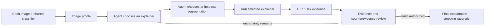

# Agentic Color-LIME XAI

An explainable-AI research system that lets a code-grounded agent select and
evaluate **LIME, sparse LIME (Lasso), and Kernel SHAP**, then choose a segmentation.
It accepts one or multiple images, with independent agent decisions for each.
**Color-LIME** supplies weighted color groups as an alternative to spatial superpixels.

> **Status:** research prototype under active development.

## Read the application in one file

[`agentic_xai_commented.py`](agentic_xai_commented.py) contains the complete current
application as ordinary Python definitions, with a reading map, 12 numbered
sections, and comments explaining functions, decisions, loops, and state changes.
It includes the CLI, Streamlit interface, batch processing, classifier adapter,
agent, LIME/Lasso-LIME/SHAP, all five segmentations, CIR, and saved evidence.

Start with the execution map at the top. Follow Sections 02–04 for the overall
flow, Section 06 for the agent loop, and Sections 07–10 for what each tool does.
Section 12 explains where Python actually starts executing the application.

After installing the dependencies described below, run either entry point:

```bash
python agentic_xai_commented.py --image images/first.jpg images/second.jpg
python -m streamlit run agentic_xai_commented.py
```

The file also works when copied outside the checkout with dependencies installed:
it imports no project modules and embeds the default settings. An optional
`--config` accepts a YAML profile. It is an annotated snapshot of the current
application; later modular changes need to be reflected in this file explicitly.
Historical benchmark/subdivision scripts remain separate.

## Historical LIME benchmark

On 84 correctly classified ImageNet validation images, Color-LIME Black
increased median Confidence Impact Ratio (CIR) and Decision Impact Ratio (DIR)
relative to default LIME:

| Method | Median CIR | DIR |
|---|---:|---:|
| Default LIME | 0.678 | 51/84 (60.7%) |
| Color-LIME Black | **0.894** | **69/84 (82.1%)** |

Color-LIME produced higher CIR on 57 of 84 paired images. It changed the model
decision on 24 images where default LIME did not; the reverse occurred on 6.
These values are recalculated from the committed CSV by
[`scripts/analyze_benchmark.py`](scripts/analyze_benchmark.py).


The comparison used `google/vit-base-patch16-224`, 1,000 LIME perturbations per
method, weighted RGB K-means with `k=256`, and critical regions covering at
least 20% of the image. Only correct predictions among the first 100 ImageNet
validation examples were evaluated. See [methodology](docs/methodology.md) for
definitions, controls, limitations, and the perturbation-policy caveat.

## What the system does

The agent receives a model prediction, cheap image statistics, registered local
method identifiers, and evidence from methods it chooses to execute. It may
inspect the actual registered source function before execution. Each candidate
must pass through the selected explainer, CIR calculation, and a separate evidence-review step
before the agent can continue or finish.



Registered segmentations are SLIC, Quickshift, Felzenszwalb, compact Watershed, and
Color-LIME. All three explainers support these five segmentations. Each
explainer/segmentation pair can be attempted once per image. The runtime enforces sequential execution, CIR after every
candidate, review before stopping, and an explicit trade-off if the selected
candidate does not have the highest observed CIR.

## Repository map

```text
src/agentic_colorlime/       agent, runtime, methods, metrics, and model adapter
configs/                     named benchmark and demo profiles
experiments/                 reproducible benchmark and follow-up research scripts
results/benchmark/           compact CSV evidence and verified derived metrics
assets/figures/              charts regenerated from committed results
tests/                       policy, metric, segmentation, and configuration tests
docs/                        architecture, methodology, history, and roadmap
```

Generated runs, restricted dataset images, model weights, and API audit data
are excluded from version control.

## Quick start

Python 3.11 is recommended.

```bash
python -m venv .venv
source .venv/bin/activate
python -m pip install -e ".[all]"
cp .env.example .env
```

Add your own `OPENAI_API_KEY` to `.env`. For gated ImageNet access, accept the
dataset conditions on Hugging Face and provide `HF_TOKEN` locally.

Run the command-line agent:

```bash
agentic-colorlime \
  --image /absolute/path/to/image.jpg \
  --config configs/agent-demo.yaml
```

To process several images (or repeat `--image`):

```bash
agentic-colorlime --image images/first.jpg images/second.jpg --config configs/agent-demo.yaml
```

A single path preserves the existing single-image output. Multiple paths create
`batch_summary.json` and separate `image-0001`, `image-0002`, ... folders. Failed
images are recorded and remaining images continue; the command exits with status
1 if any image fails. The classifier is loaded once per batch. Processing is
sequential, and each image has its own target class and agent conversation.

The interface accepts multiple uploads or one local image path per line and
lets you select a completed image to view its explanation. Launch it with:

```bash
streamlit run app.py
```

The `fast-demo` profile is a reduced-cost smoke test. The `benchmark` profile
records the reported evaluation settings; the dataset benchmark is run by the
standalone experiment script rather than the interactive agent.

## Reproduce the committed analysis

This verification needs no model download or API key:

```bash
python scripts/analyze_benchmark.py --verify
```

The full benchmark is computationally expensive and requires gated ImageNet
access:

```bash
python experiments/colorlime_benchmark.py --self-test
python experiments/colorlime_benchmark.py \
  --num-images 100 \
  --num-samples 1000 \
  --k-colors 256
```

## Explanation choices

- **LIME:** the existing binary segment perturbations and weighted Ridge surrogate.
- **Sparse LIME (`lime_lasso`):** the same sampling and masking, with a Lasso
  surrogate (`lime_lasso_alpha`, default 0.001). This is a configured LIME variant,
  not an implementation of LEMON. Its penalty may leave no positive regions.
- **Kernel SHAP (`shap`):** treats each segment as present or hidden and explains
  the original target-class probability against an all-hidden background. It
  shares LIME's `hide_color` policy, including segment means when it is null.
  SHAP does not universally require segmentation; this integration deliberately
  uses it to make the image features comparable and keep classifier access model-agnostic.

Kernel SHAP uses 512 requested coalition samples and a 256-segment limit by
default. A finer segmentation fails that candidate with a recorded message so
the agent can choose another. Override with `--shap-samples` and
`--shap-max-segments`; increasing these settings increases computation. The
explicit SHAP feature-selection setting is `num_features(10)` (or fewer if the
image has fewer segments). Saved diagnostics include all signed weights, the
background prediction, and the additivity residual. The residual is an accounting
check, not a quality score. LIME variants retain their surrogate score separately.

Set `--lime-lasso-alpha` to configure the sparse variant. These settings also work
in the YAML `experiment` section and in the app. The agent chooses algorithms
and segmentations; numeric settings remain user-controlled.

The existing area-based positive-region selection and CIR omission test apply
to every candidate. Whole segments may exceed the requested area, and CIR alone
does not establish explanation faithfulness. Batch runs create separate evidence
per image rather than a single explanation for the whole collection. More images
and comparisons require more classifier computation and agent API calls.

See [implementation details and references](docs/multi-explainer.md).
The historical results above have **not** been re-evaluated for SHAP or sparse LIME.

## Current capabilities

The implemented agent **selects, executes, evaluates, and stops between XAI
methods**. Experiment parameters are currently loaded from a named profile or
set in the interface. Agent-controlled parameter configuration is future work.

The benchmark is specific to one model and ImageNet evaluation slice. Subset
selection, black deletion, off-state differences, sample size, and omission
artifacts constrain how broadly the results generalize.

## Documentation

- [Architecture and control flow](docs/architecture.md)
- [Benchmark methodology and limitations](docs/methodology.md)
- [Research timeline](docs/research-history.md)
- [Research and engineering roadmap](docs/roadmap.md)

## Citation and license

Citation metadata is available in [`CITATION.cff`](CITATION.cff). Code is
released under the MIT License. ImageNet data and pretrained models retain their
own terms and are not redistributed by this repository.
