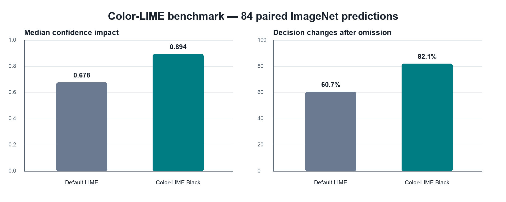
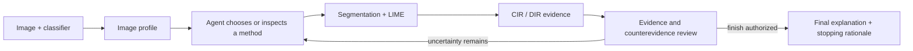

# Agentic Color-LIME XAI

An explainable-AI research system that lets a code-grounded agent select and
evaluate image-LIME segmentation methods, including **Color-LIME**, a weighted
color-clustering alternative to conventional spatial superpixels.

> **Status:** research prototype under active development.

## Result at a glance

On 84 correctly classified ImageNet validation images, Color-LIME Black
increased median Confidence Impact Ratio (CIR) and Decision Impact Ratio (DIR)
relative to default LIME:

| Method | Median CIR | DIR |
|---|---:|---:|
| Default LIME | 0.678 | 51/84 (60.7%) |
| Color-LIME Black | **0.894** | **69/84 (82.1%)** |

Color-LIME produced higher CIR on 57 of 84 paired images. It changed the model
decision on 24 images where default LIME did not; the reverse occurred on 6.
These values are recalculated from the committed CSV by
[`scripts/analyze_benchmark.py`](scripts/analyze_benchmark.py).



The comparison used `google/vit-base-patch16-224`, 1,000 LIME perturbations per
method, weighted RGB K-means with `k=256`, and critical regions covering at
least 20% of the image. Only correct predictions among the first 100 ImageNet
validation examples were evaluated. See [methodology](docs/methodology.md) for
definitions, controls, limitations, and the perturbation-policy caveat.

## What the system does

The agent receives a model prediction, cheap image statistics, registered local
method identifiers, and evidence from methods it chooses to execute. It may
inspect the actual registered source function before execution. Each candidate
must pass through LIME, CIR calculation, and a separate evidence-review step
before the agent can continue or finish.



Registered methods are SLIC, Quickshift, Felzenszwalb, compact Watershed, and
Color-LIME. The runtime enforces sequential execution, CIR after every
candidate, review before stopping, and an explicit trade-off if the selected
candidate does not have the highest observed CIR.

## Repository map

```text
src/agentic_colorlime/       agent, runtime, methods, metrics, and model adapter
configs/                     named benchmark and demo profiles
experiments/                 reproducible benchmark and follow-up research scripts
results/benchmark/           compact CSV evidence and verified derived metrics
assets/figures/              charts regenerated from committed results
tests/                       policy, metric, segmentation, and configuration tests
docs/                        architecture, methodology, history, and roadmap
```

Generated runs, restricted dataset images, model weights, and API audit data
are excluded from version control.

## Quick start

Python 3.11 is recommended.

```bash
python -m venv .venv
source .venv/bin/activate
python -m pip install -e ".[all]"
cp .env.example .env
```

Add your own `OPENAI_API_KEY` to `.env`. For gated ImageNet access, accept the
dataset conditions on Hugging Face and provide `HF_TOKEN` locally.

Run the command-line agent:

```bash
agentic-colorlime \
  --image /absolute/path/to/image.jpg \
  --config configs/agent-demo.yaml
```

Or launch the interface:

```bash
streamlit run app.py
```

The `fast-demo` profile is a reduced-cost smoke test. The `benchmark` profile
records the reported evaluation settings; the dataset benchmark is run by the
standalone experiment script rather than the interactive agent.

## Reproduce the committed analysis

This verification needs no model download or API key:

```bash
python scripts/analyze_benchmark.py --verify
```

The full benchmark is computationally expensive and requires gated ImageNet
access:

```bash
python experiments/colorlime_benchmark.py --self-test
python experiments/colorlime_benchmark.py \
  --num-images 100 \
  --num-samples 1000 \
  --k-colors 256
```

## Current capabilities

The implemented agent **selects, executes, evaluates, and stops between XAI
methods**. Experiment parameters are currently loaded from a named profile or
set in the interface. Agent-controlled parameter configuration is future work.

The benchmark is specific to one model and ImageNet evaluation slice. Subset
selection, black deletion, off-state differences, sample size, and omission
artifacts constrain how broadly the results generalize.

## Documentation

- [Architecture and control flow](docs/architecture.md)
- [Benchmark methodology and limitations](docs/methodology.md)
- [Research timeline](docs/research-history.md)
- [Research and engineering roadmap](docs/roadmap.md)

## Citation and license

Citation metadata is available in [`CITATION.cff`](CITATION.cff). Code is
released under the MIT License. ImageNet data and pretrained models retain their
own terms and are not redistributed by this repository.
