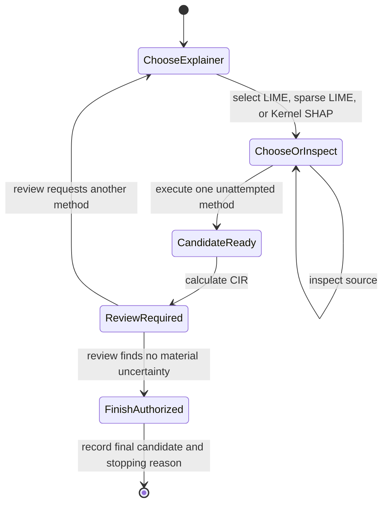

# Architecture

## Design goal

The system asks a bounded question: given one image-classification prediction
and several explainer/segmentation combinations, can an agent gather enough
evidence to select a defensible explanation and justify when additional method
execution is unnecessary?

The LLM does not receive hand-written claims about which segmentation method is
best. It sees method identifiers, may inspect the registered local source, and
must ground later decisions in outputs actually produced by the runtime.

Each batch reuses one loaded classifier but creates a fresh runtime and agent
conversation for each image. Errors and partial audit records stay with that
image. `batch_summary.json` is updated atomically as images finish.

## Components

| Component | Responsibility |
|---|---|
| `model_runner.py` | Adapts a Hugging Face classifier to a shared probability interface. |
| `image_profile.py` | Computes inexpensive local image statistics before any explanation call. |
| `tool_catalog.py` | Exposes identifiers for registered methods without qualitative recommendations. |
| `segmentations.py` | Implements SLIC, Quickshift, Felzenszwalb, Watershed, and Color-LIME. |
| `lime_engine.py` | Runs Ridge or Lasso LIME with fixed segments and extracts positive features. |
| `shap_engine.py` | Runs segment-based Kernel SHAP in bounded image batches. |
| `batch.py` | Processes images independently, reuses the classifier, and saves a batch manifest. |
| `cir.py` | Omits the selected critical region and computes CIR plus decision change. |
| `runtime.py` | Owns state, legal transitions, artifacts, failures, and evidence comparisons. |
| `openai_agent.py` | Defines tool schemas, calls the Responses API, validates actions, and records audits. |
| `pipeline.py` | Connects image loading, prediction, runtime, agent, and final output. |

## Enforced state machine

The runtime—not the model prompt alone—enforces these transitions:

1. Only one tool call is accepted per decision round.
2. An explainer must be selected before its segmentation; each pair is attempted at most once per image.
3. A candidate must have CIR before it can be reviewed or selected.
4. The final-selection tool is hidden until a review authorizes stopping.
5. Declared material uncertainty prevents stopping.
6. Selecting a lower-CIR candidate requires an explicit trade-off.

This separation matters because prompts express intended behavior, whereas
runtime validation provides inspectable enforcement.

An explanation result carries a critical mask and method-specific diagnostics.
SHAP has no LIME surrogate score. Candidate summaries identify both `explainer`
and `segmentation_method`; legacy LIME method names and LIME-only score/time
keys remain available for existing consumers. Non-LIME candidates have unique
method IDs such as `shap_slic`, so artifacts and failures cannot collide.

## Color-LIME

Color-LIME replaces spatial superpixels with weighted RGB color groups:

1. Resize and convert an image to RGB.
2. Extract unique RGB colors and their pixel frequencies.
3. Fit weighted K-means to the unique colors.
4. Assign every pixel the cluster of its RGB value.
5. Use these cluster labels as LIME-interpretable binary features.

The committed benchmark uses 256 requested color clusters. Because features
follow color rather than spatial connectivity, the same feature can appear in
separate parts of an image. This is intentional and is also a limitation when
spatial coherence is important.

## Audit trail

Each agent run writes candidate measurements, tool calls, decisions, evidence
reviews, and exact application-generated API request/response payloads. Those
audits may contain private images as data URLs and are excluded from Git.

The audit records application inputs, outputs, and executed tool actions. It
does not store provider-side reasoning.
